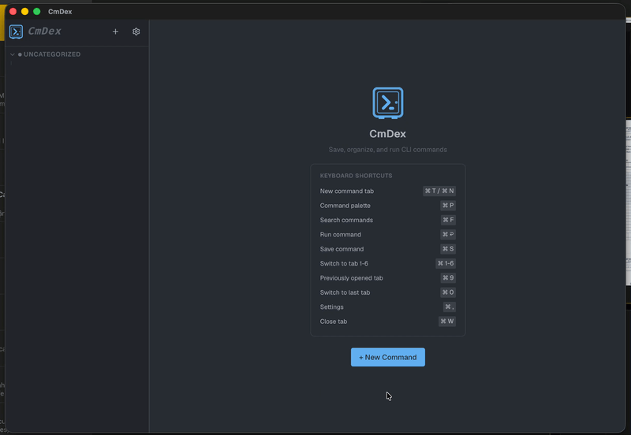

# CmDex

<p align="center">
  
</p>

> Your command library, everywhere. Save, organize, and run CLI commands with smart templates — on **macOS**, **Windows**, and **Linux**.

CmDex is a beautiful cross-platform desktop app that turns your scattered terminal commands into a searchable, categorized library. No more digging through shell history or forgetting that one Docker command you only run once a month.

## Download

**Ready to use?** Grab the latest installer for your platform from the [GitHub Releases](https://github.com/fenv-org/commamer/releases) page:

- **macOS** — `.dmg` disk image
- **Windows** — `.exe` installer
- **Linux** — `.AppImage`, `.deb`, or `.rpm`

No build tools, no terminal setup — just download, install, and start saving commands.

## Features

- **Template Variables** — Drop `{{variableName}}` into any command. CmDex auto-detects variables as you type and prompts you when you run.
  ```bash
  docker logs -f --tail {{lines}} {{container_name}}
  ```
- **Organized Library** — Group commands into color-coded categories. Keep work scripts, deployment commands, and personal utilities in their own spaces.
- **Variable Presets** — Save named sets of values (e.g., "staging" vs. "production" configs) and switch between them instantly.
- **Smart Defaults** — Defaults support CEL expressions like `now()`, `env("HOME")`, and `date("2006-01-02")` so your commands are always up to date.
- **Run Anywhere** — Execute commands inside CmDex with a built-in streaming output panel, or open them directly in your favorite terminal (Terminal, iTerm2, Warp, Alacritty, Kitty, Ghostty, and more).
- **Lightning Search** — Find any command by title, description, tag, or script content in milliseconds (powered by SQLite FTS5).
- **Fully Local** — Everything lives on your machine in `~/.cmdex/cmdex.db`. No accounts, no cloud, no subscriptions.
- **Dark & Polished** — A premium dark UI with glassmorphism, smooth animations, and a layout that feels right at home on any OS.

## For Developers

Want to hack on CmDex or build from source?

### Tech Stack

- **Backend**: Go with SQLite (pure Go, no CGo)
- **Desktop**: Wails v3
- **Frontend**: React 18 + TypeScript + Vite
- **UI**: shadcn/ui (Radix UI + Tailwind CSS)

### Build from Source

```bash
# Prerequisites: Go 1.25+, Node.js 25+, pnpm, Wails v3 CLI
go install github.com/wailsapp/wails/v3/cmd/wails3@v3.0.0-alpha.74

# Clone & install
git clone <repo-url>
cd cmdex
cd frontend && pnpm install && cd ..

# Dev mode (hot-reload)
wails3 dev

# Production build
wails3 build
```

### Project Layout

- `main.go` — App entry & native menu
- `app.go` — Backend services exposed to the UI
- `db.go` — SQLite database with FTS5 search
- `executor.go` — Command execution, streaming output, terminal detection
- `frontend/src/` — React frontend

## License

CmDex is licensed under the [Apache License 2.0](LICENSE).

- The **core app** is free and open source — you can use, modify, and distribute it freely.